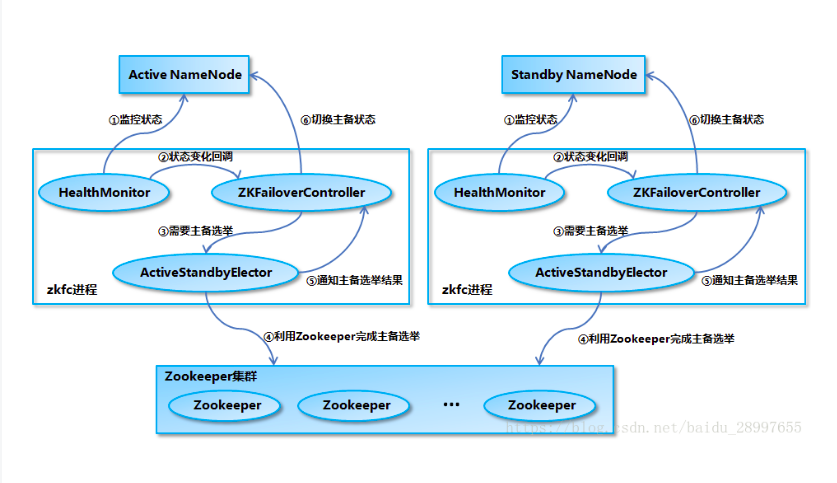
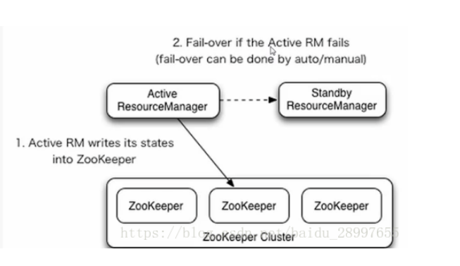
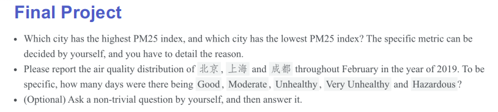
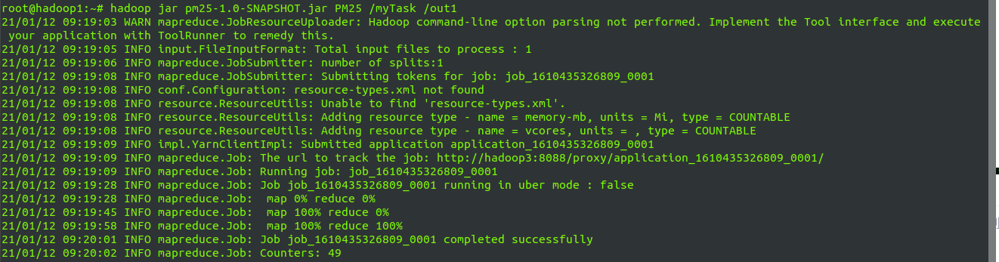
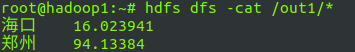
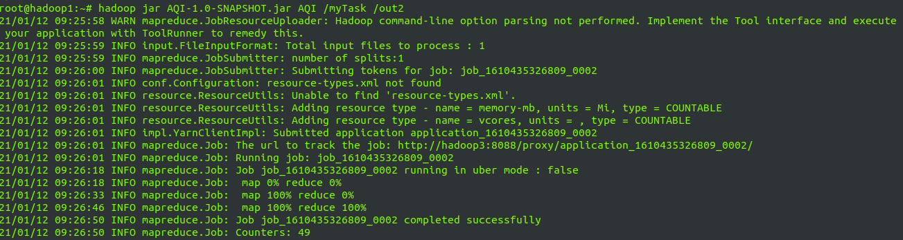
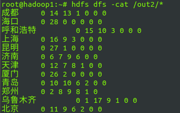
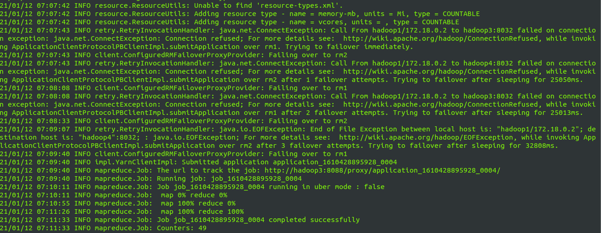

# Distributed System and Big Data

## Task 3
使用Docker搭建Hadoop HA集群

Docker VS  VM

选择Docker还能方便将来将容器真正的部署到集群上。

### Hadoop HA架构
| ip | hostname | application | process |
| ---- | ---- | ---- | ---- |
| 172.18.0.2 | hadoop1 | hadoop jdk |DFSZKFailoverController<br>NameNode|
| 172.18.0.3 | hadoop2 | hadoop jdk |DFSZKFailoverController<br>NameNode|
| 172.18.0.4 | hadoop3 | hadoop jdk |ResourceManager|
| 172.18.0.5 | hadoop4 | hadoop jdk |ResourceManager|
| 172.18.0.6 | hadoop5 | hadoop jdk |DataNode<br>NodeManager|
| 172.18.0.7 | hadoop6 | hadoop jdk |DataNode<br>NodeManager|
| 172.18.0.8 | hadoop7 | hadoop jdk |DataNode<br>NodeManager|
| 172.18.0.13 | hadoop8 | zookeeper |zookeeper|
| 172.18.0.12 | hadoop9 | zookeeper |zookeeper|
| 172.18.0.14 | hadoop10 | zookeeper |zookeeper|
| 172.18.0.11 | hadoop11 | hadoop jdk|JournalNode|
| 172.18.0.10 | hadoop12 | hadoop jdk |JournalNode|
| 172.18.0.11 | hadoop13 | hadoop jdk |JournalNode|

---
#### NameNode HA
[](https://blog.csdn.net/baidu_28997655/article/details/81906591)
NameNode HA通过zookeeper进行状态监管，通过JournalNode（[QJM原理](https://hadoop.apache.org/docs/r2.7.1/hadoop-project-dist/hadoop-hdfs/HDFSHighAvailabilityWithQJM.html)）进行EditLog一致性管理（Paxos）
#### Yanr HA
[](https://blog.csdn.net/baidu_28997655/article/details/81906591)

## Hadoop HA搭建
1. 构建镜像
```
#Dockerfile
FROM openjdk:8-jdk-buster
MAINTAINER <NIU> 
WORKDIR /root
ADD hadoop-2.10.1.tar.gz .
RUN mv hadoop-2.10.1 /usr/local/hadoop 

# hadoop环境变量配置
ENV HADOOP_HOME /usr/local/hadoop
ENV HADOOP_CONFIG_HOME /usr/local/hadoop/etc/hadoop
ENV HADOOP_LIBEXEC_DIR /usr/local/hadoop/libexec
ENV HADOOP_COMMON_HOME $HADOOP_HOME
ENV HADOOP_HDFS_HOME $HADOOP_HOME
ENV HADOOP_CONF_DIR  /usr/local/hadoop/etc/hadoop
ENV PATH $PATH:/usr/local/hadoop/bin:/usr/local/hadoop/sbin:

RUN apt-get update && apt-get install -y openssh-server vim && \
	ssh-keygen -t rsa -f ~/.ssh/id_rsa -P '' && \
    cat ~/.ssh/id_rsa.pub >> ~/.ssh/authorized_keys && \
	mkdir /run/sshd 

RUN echo "export JAVA_HOME=\"/usr/local/openjdk-8\"" >> .bashrc && \
	echo "export JAVA_VERSION=\"8u275\"" >> .bashrc

RUN echo "root:123" | chpasswd
EXPOSE  22

ENTRYPOINT /usr/sbin/sshd -D
```
2. 配置文件

 - `core-site.xml`
```
	<property>
            <name>fs.defaultFS</name>
            <value>hdfs://ns1</value>
        </property>
    <!-- 指定hadoop运行时产生文件的存储目录 -->
     <property>
            <name>hadoop.tmp.dir</name>
            <value>/usr/local/hadoop/tmp</value>
    </property>
        <!-- 指定zookeeper地址-->
     <property>
            <name>ha.zookeeper.quorum</name>
            <value>hadoop8:2181,hadoop9:2181,hadoop10:2181</value>
     </property>

```
- `hdfs-site.xml`
```
    <!--指定hdfs的nameservice为ns1，需要和core-site.xml中的保持一致 -->
    <property>
            <name>dfs.nameservices</name>
            <value>ns1</value>
    </property>
    <!-- ns1下面有两个NameNode，分别是nn1，nn2 -->
    <property>
            <name>dfs.ha.namenodes.ns1</name>
            <value>nn1,nn2</value>
    </property>
    <!-- nn1的RPC通信地址 -->
    <property>
            <name>dfs.namenode.rpc-address.ns1.nn1</name>
            <value>hadoop2:9000</value>
    </property>
    <!-- nn1的http通信地址 -->
    <property>
            <name>dfs.namenode.http-address.ns1.nn1</name>
            <value>hadoop2:50070</value>
    </property>
    <!-- nn2的RPC通信地址 -->
    <property>
            <name>dfs.namenode.rpc-address.ns1.nn2</name>
            <value>hadoop1:9000</value>
    </property>
    <!-- nn2的http通信地址 -->
    <property>
            <name>dfs.namenode.http-address.ns1.nn2</name>
            <value>hadoop1:50070</value>
    </property>
    <!-- 指定NameNode的元数据在JournalNode上的存放位置 -->
    <property>
            <name>dfs.namenode.shared.edits.dir</name>
            <value>qjournal://hadoop11:8485;hadoop12:8485;hadoop13:8485/ns1</value>
    </property>
    <!-- 指定JournalNode在本地磁盘存放数据的位置 -->
    <property>
            <name>dfs.journalnode.edits.dir</name>
            <value>/usr/local/hadoop/journaldata</value>
    </property>
    <!-- 开启NameNode失败自动切换 -->
    <property>
            <name>dfs.ha.automatic-failover.enabled</name>
            <value>true</value>
    </property>
    <!-- 配置失败自动切换实现方式 -->
    <property>
            <name>dfs.client.failover.proxy.provider.ns1</name>
            <value>org.apache.hadoop.hdfs.server.namenode.ha.ConfiguredFailoverProxyProvider</value>
    </property>
    <!-- 配置隔离机制方法，多个机制用换行分割，即每个机制暂用一行 -->
    <property>
            <name>dfs.ha.fencing.methods</name>
            <value>
                    sshfence
                    shell(/bin/true)
            </value>
    </property>
    <!-- 使用sshfence隔离机制时需要ssh免登陆 -->
    <property>
            <name>dfs.ha.fencing.ssh.private-key-files</name>
            <value>/home/root/.ssh/id_rsa</value>
    </property>
    <!-- 配置sshfence隔离机制超时时间 -->
    <property>
            <name>dfs.ha.fencing.ssh.connect-timeout</name>
            <value>30000</value>
    </property>

```
- `mapred-site.xml`
```
    <!-- 指定mr运行在yarn上 -->
    <property>
            <name>mapreduce.framework.name</name>
            <value>yarn</value>
    </property>

```
- `yarn-site.xml`
```
    <!-- reducer获取数据的方式 -->
    <property>
            <name>yarn.nodemanager.aux-services</name>
            <value>mapreduce_shuffle</value>
     </property>
   <!-- 开启RM高可用 -->
     <property>
           <name>yarn.resourcemanager.ha.enabled</name>
           <value>true</value>
     </property>
    <!-- 指定RM的cluster id -->
     <property>
           <name>yarn.resourcemanager.cluster-id</name>
           <value>yrc</value>
     </property>
    <!-- 指定RM的名字 -->
     <property>
           <name>yarn.resourcemanager.ha.rm-ids</name>
           <value>rm1,rm2</value>
     </property>
    <!-- 分别指定RM的地址 -->
     <property>
           <name>yarn.resourcemanager.hostname.rm1</name>
           <value>hadoop3</value>
     </property>
     <property>
           <name>yarn.resourcemanager.hostname.rm2</name>
           <value>hadoop4</value>
     </property>
    <!-- 指定zk集群地址 -->
     <property>
           <name>yarn.resourcemanager.zk-address</name>
          <value>hadoop8:2181,hadoop9:2181,hadoop10:2181</value>
     </property>
     <!--运行jar出现prelaunch.err新增-->
    <property>
        <name>yarn.resourcemanager.webapp.address.rm1</name>
        <value>hadoop3:8088</value>
    </property>
    <property>
        <name>yarn.resourcemanager.scheduler.address.rm2</name>
        <value>hadoop4:8030</value>
    </property>
    <property>
        <name>yarn.resourcemanager.webapp.address.rm2</name>
        <value>hadoop4:8088</value>
    </property>

```
- `slaves`
```
hadoop5
hadoop6
hadoop7
``` 

上述配置相关设置主要参考[CSDN](https://blog.csdn.net/u014296502/article/details/75277444)以及[hadoop.apache.org](https://hadoop.apache.org/docs/r2.10.0/hadoop-project-dist/hadoop-hdfs/HDFSHighAvailabilityWithQJM.html)

3. 启动容器组
    - 创建Docker本地网络  
         > docker network creat <name>   
    - 拉起集群  
   通过`start.sh`启动集群，使用的镜像是已经修改过配合的 

4. 启动
    - 密钥分发
    - zookeeper启动
    - JournalNode启动
        > hadoop-daemon.sh start journalnode  
    - namenode格式化
      > hdfs namenode -format  
      > scp /tmp hadoop2:/tmp  
      > hdfs namenode -bootstrapStandby  
      > hadoop-daemon.sh start namenode

    - 格式化ZKFC
      > hdfs zkfc -formatZK

    - 全面启动
      > start-dfs.sh

    - 启动yarn
      > yarn-daemon.sh start resourcemanager  
      > start-yarn.sh  

    - 全面停止
      > stop-dfs.sh

5. 停止容器组
   使用`clean.sh`脚本

## Task 1 And Task 2
具体问题

代码详情见`code`文件夹

#### 代码执行
1. Task1
   - 运行
   
   - 结果
   

2. Task2
   - 运行
   
   - 结果
   


## 发现记录
1. 在测试NameNode高可用时误将zookeeper监视进程杀死，结果同样将standby NameNode状态转换
2. yarn HA
   